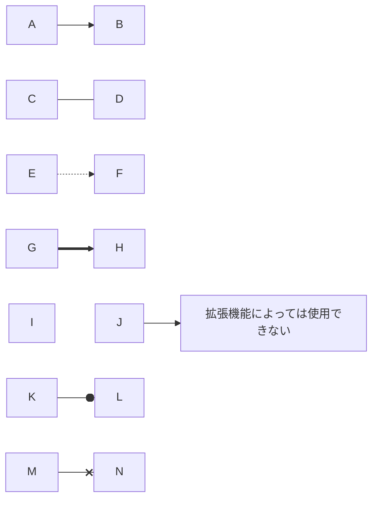

# AWSの構成図をMarkdownで書こう

## 参考サイト
[AstroにMarkdown記法でダイアグラムやチャート描画できるようにした | UKIGUMO CAFE - ブログ・ポートフォリオサイト](https://nova.drifting-clouds.com/ja/blog/mermaid-drawing-with-mdx)

```mermaid
flowchart LR
    A --> B
    C --- D
    E -.-> F
    G ==> H
    I ~~~ J --> 拡張機能によっては使用できない
    K --o L
    M --x N
```